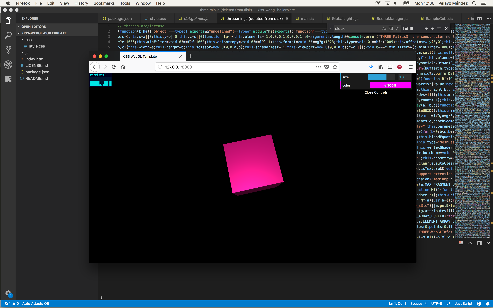

# KISS WebGL Boilerplate

This is a simple as possible boilerplate to quickly start personal WebGL demo projects.

The heart of the template is the Javascript 3D library [Thee.js](https://threejs.org/) and from there it may grow with other useful libraries and tools.

It's optimized to be coded with [Visual Studio Code](https://code.visualstudio.com/) and makes use of [Node.js and the npm package manager](https://www.npmjs.com/get-npm).



## How to use

1) Make sure you have [Node.js and the npm package manager](https://www.npmjs.com/get-npm) installed:

```
node -v
npm -v
```

2) Clone this repo in any folder. 

3) Install dependencies and run the template:

```
npm preinstall
npm install
npm start
open http://localhost:8000 in your browser
```

## References

- [Three.js 101 : Hello World!](https://threejs.org/docs/#manual/introduction/Creating-a-scene)<br>
<i>@necsoft</i><br>An introduction to Three.js from a Creative Coder perspective.

- [How to organize your Three.js code in a cleaner way](https://medium.com/@soffritti.pierfrancesco/how-to-organize-the-structure-of-a-three-js-project-77649f58fa3f)<br>
<i>Pierfrancesco Soffritti</i><br>How to write clear and maintainable Three.js code.
